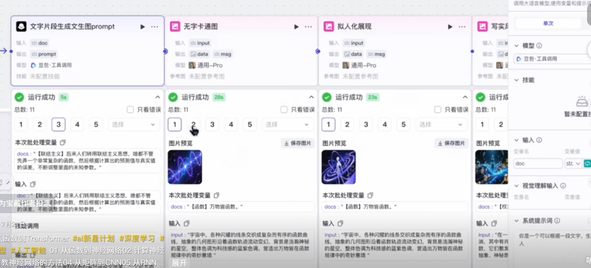

## 词汇
#### 函数,参数,权重,大模型,大语言模型,训练,预训练,微调,推理,涌现
1. 复杂的**函数**也就是**模型**
2. **模型**里的**参数**也就是**权重**
3. **模型**里的**参数**特别大就叫做**大模型**，用于**NLP**语言处理的模型就叫**大语言模型**
4. 调整模型参数的过程就是**训练**，事先训练好一个基础模型的方式叫做**预训练**，基于预训练的模型让模型学会具体的任务叫做**微调**。
5. 参数调整好后，根据函数的输入计算函数输出的结果的过程叫做**推理**。对话能力有质的提升，产生推理能力或者出现了之前没有的能力的现象叫做**涌现emergence**。

#### GPT,私有化部署,生成式AI,token,上下文,prompt,随机性,温度,Top-K,幻觉。
6. chatgpt背后使用的模型叫做**GPT(generative pre-trained transformer)**是一个系列。
7. 将训练好的模型部署到本地叫做**私有化部署**，能持续输出文本和图像的AI叫做**生成式AI**。
8. 每个分割成最小力度的词叫做**token**，对话式所有给到大模型的信息叫做**上下文(context)**，从另一个角度也可以叫提示词**prompt**，控制输出的**随机性randomness**的参数叫做**温度**，控制从概率最高的k个词中选择叫做**Top-K**，随机性太高，模型容易胡说八道，随机性太低，又容易过于保守。
9. 语言上说得通，但是实际是错的叫**幻觉hallucination**，解决幻觉问题提供了**联网**能力。

#### 知识库，RAG，向量数据库，词嵌入，向量检索，多模态能力，工作流，langchain，agent，MCP，A2A。
10. 有些内部资料不方便公开，又希望大模型去执行私有的数据库中查找答案，这种数据库一般叫做**知识库knowledge base**，这种模式较多**检索增强生成RAG(Retrieval-Augmented Generation)**。为了让模型和知识库中的语义匹配，知识通常都以向量的方式存储在**向量数据库vector database**中。
11. 把文字转换成向量的方式叫做**词嵌入embedding**，对比词向量的相似度以便在向量数据库找到相关的答案的过程叫做**向量检索**。
12. 大模型能处理文本，声音，视频等多种形式内容，这种能力叫做**多模态multimodal**。
13. 把多个AI的步骤编排成一个流的方式叫做**工作流**，在页面上傻瓜编程的工作流的方式叫做**扣子coze**，用代码编排工作流的方式叫做**langchain**
    
    

14. 按照工作流，封装大模型和一整套工具集，用于自动完成某一类复杂任务的程序叫做**智能体agent**，多个智能体一起工作叫做**多智能体**。
15. **MCP(Model Context Protocol)**给了AI一个操作外部世界的统一标准，谷歌退出的另一个给agent和agent之间通信叫做**A2A(agent-to-agent protocol)**   

    

#### 模型压缩,量化,蒸馏,剪枝,LoRA
15. 让模型更小以便减少成本叫做**模型压缩model compression**，包括把模型的浮点数用更低精度方式表示以减少缓存和计算叫**量化Quantization**，用参数较大的大模型指导参数较小的小模型叫**蒸馏Distillation**，删除模型中多余的神经元让模型提升速度叫做**剪枝pruning**，用更低成本**改善微调成本**的方法**LoRA(low-rank adaptation)**。

#### 思维链，RLHF人类反馈强化学习，NLP自然语言处理，CV计算机视觉，文字转语音TTS，语音转文字的ASR，Sora
16. 从推理能力方向增强模型能力的方式叫**Chain-of-Thought思维链**，通过人类反馈强化学习让模型说的话更合人的心意方法叫**RLHF人类反馈强化学习**。
17. 封装现有的大模型接口对外提供服务叫做**套壳**。
18. 和文字相关的模型是**NLP自然语言处理**比如chatgpt，和图片相关的是**CV计算机视觉**比如Midjourney，和语音相关的包括**文字转语音TTS**和**语音转文字的ASR**，和视频相关的包括**Sora, Kling, Dreamina**。

#### GPU，CUDA框架，TPU，NPU，Ollama，vLLM
19. 帮助更好实现AI的也有包括**GPU**和英伟达配套的**CUDA框架**，比如还有大规模用于神经网络训练和推理的**TPU(tensor processing unit)和专门用于终端设备推理的AI加速芯片NPU(Neural Porcessing Unit)**。
20. 还有和AI相关的比如**python**和提供AI编程的库**PyTorch深度学习框架**，**TensorFlow**，建设AI开源平台与社区**Hugging Face**。方便开发者本地运行的工具**Ollama**，提升大预言模型推理能力的工具**vLLM**。

#### 多层感知机MLP，CNN卷积神经网络，RNN循环神经网络，Attention机制，Transformer架构
21. 经典神经网络架构的基础全连接网络**多层感知机MLP(Multilayer Perceptron)**，用于图像数据处理的**CNN卷积神经网络**，用于序列数据处理的**RNN循环神经网络**，以及现在流行的**Attention机制**和基于attention机制发明的**Transformer架构**。