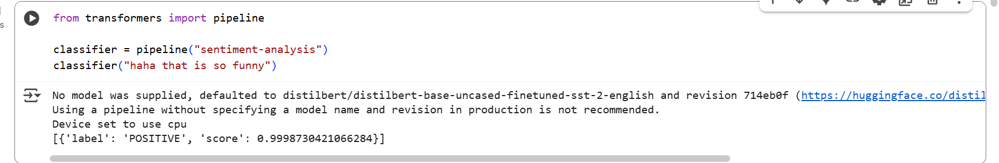
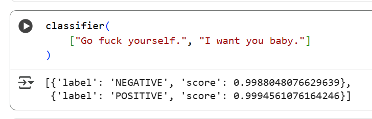
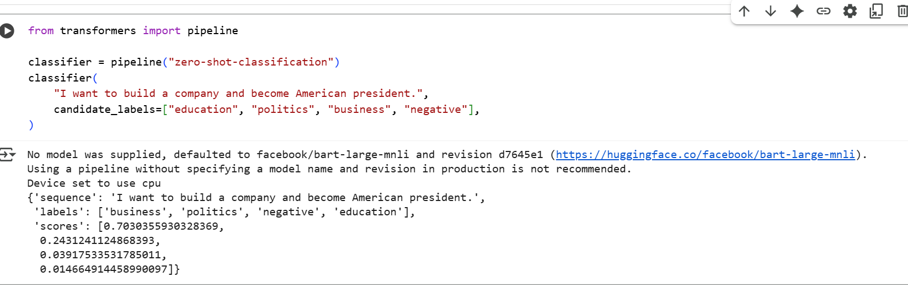
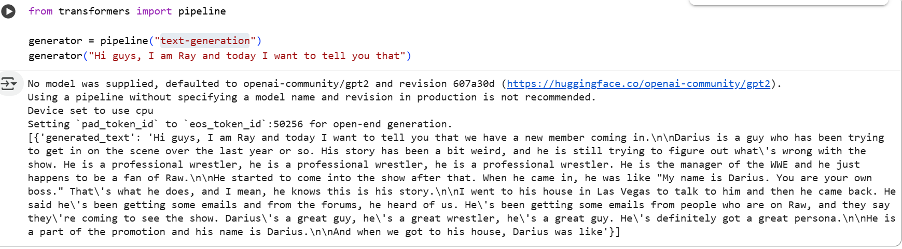
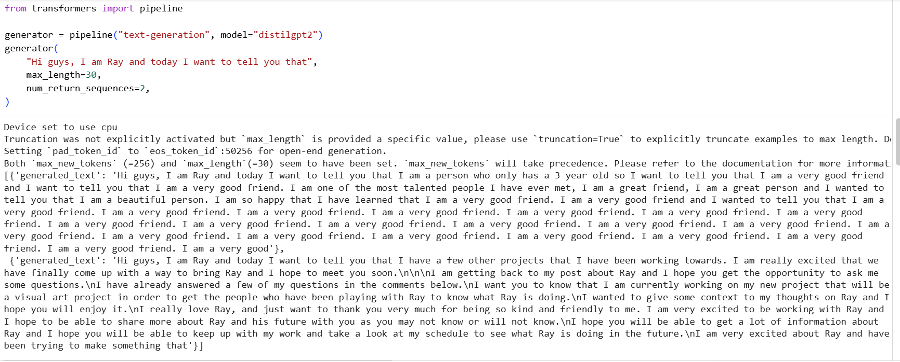
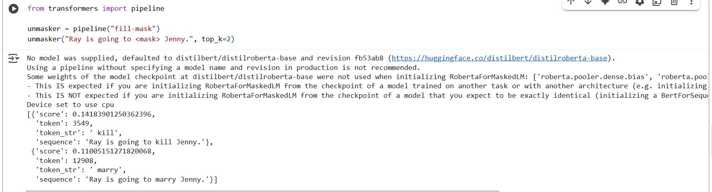
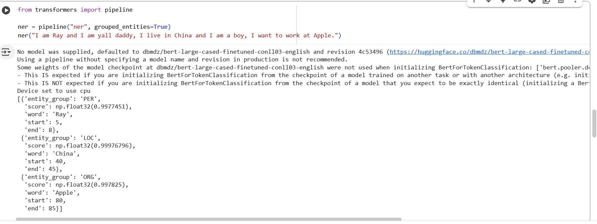
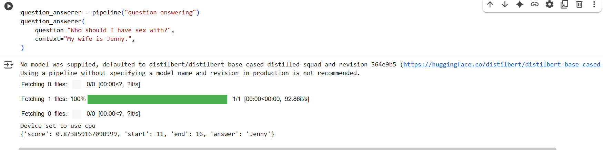
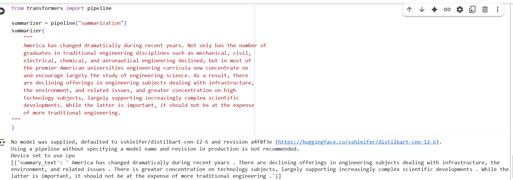
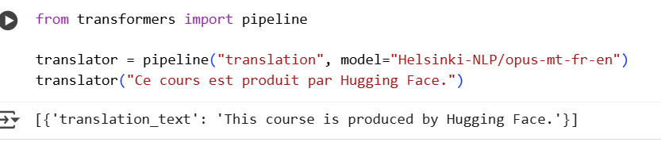

## Pipeline
Transformers 库中最基本的对象是pipeline()函数。它将模型与其必要的预处理和后处理步骤连接起来，使我们能够直接输入任何文本并获得可理解的答案

## Task
```!pip install datasets evaluate transformers[sentencepiece]```
#### sentiment-analysis





#### zero-shot-classification



#### text-generation





#### fill-mask



#### ner(Named entity recognition)



#### question-answering



#### summarization



#### translation

