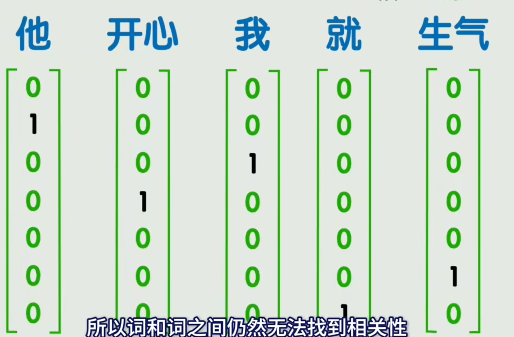
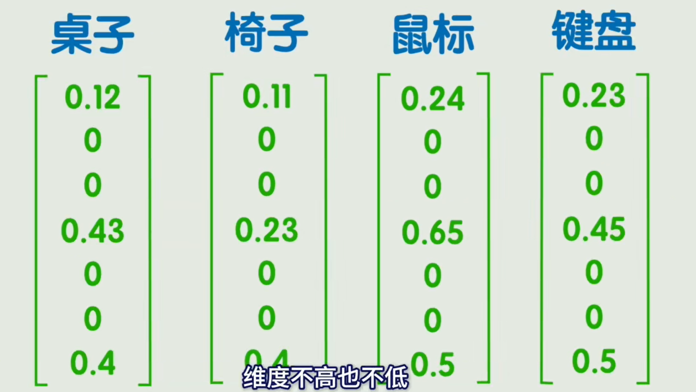
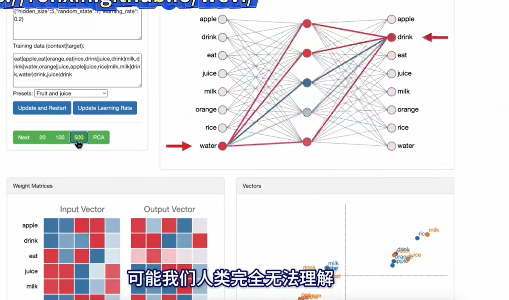
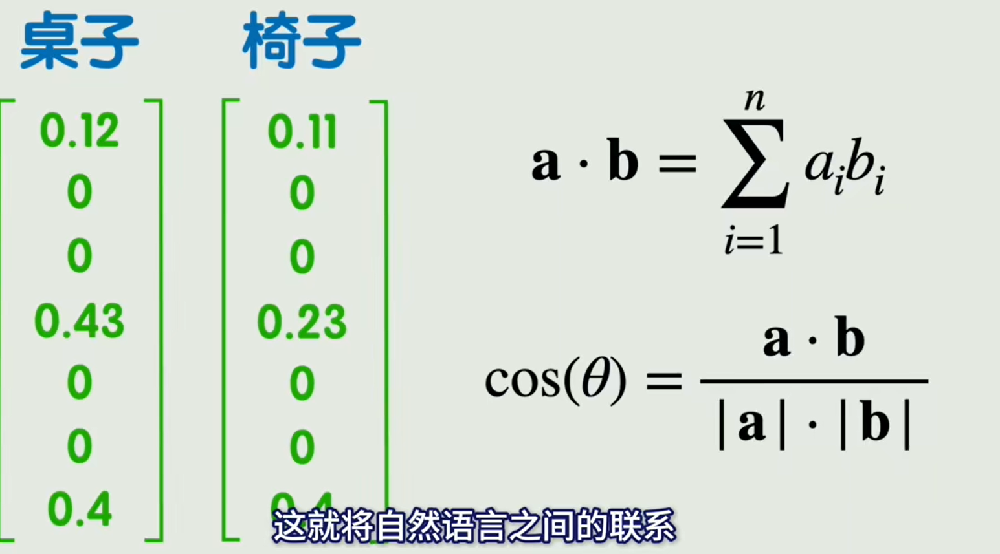
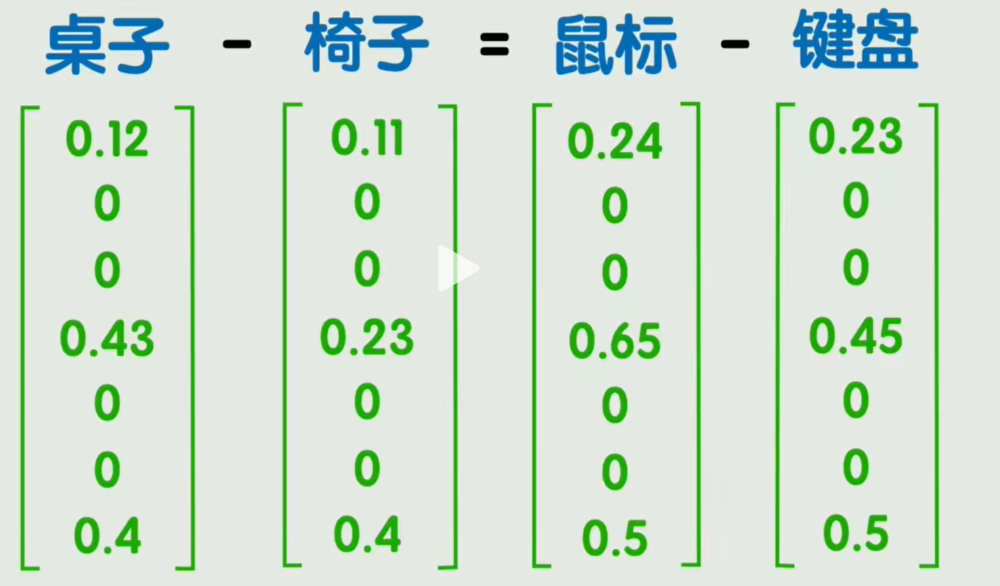
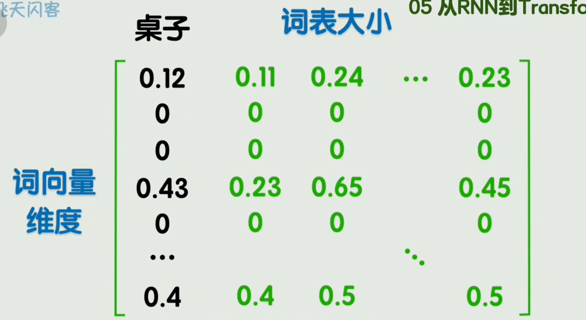
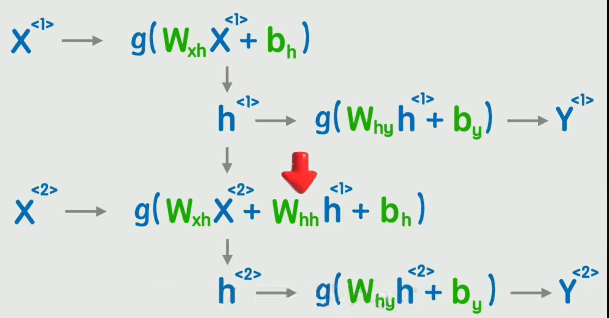
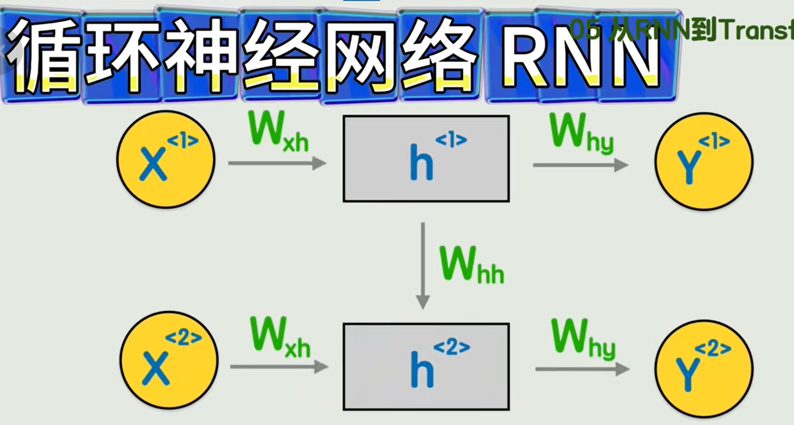
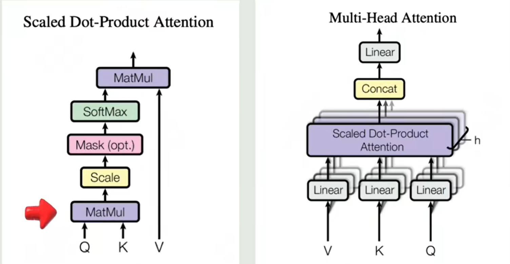
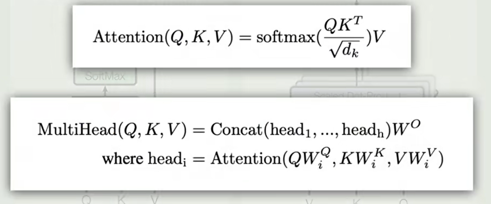

## 文字编码
- 要让机器识别文字，需要先对文字进行编码：
    - **One-hot 编码**：用一个长度为“词表大小”的向量表示词语，每一个词在其中占一个索引
        - 向量极长，且没有语义关系。
        
        

    - Embedding（词嵌入）：用一个稠密的低维向量（例如 300 维）表示词语
        - 通过训练让相似词的向量更接近。

        

        >但是词向量的维度里面的每个特征是机器训练出来的，可能特征是什么可能我们人类也无法理解

        

        - 通过向量之间的**点积**和**余弦相似度**来表示向量之间的相关性：

            

            > 可能会出现一些神奇的现象，比如桌子 - 椅子 = 鼠标 - 键盘

            

        - 将所有的词向量组成一个大的矩阵，称为**嵌入矩阵**：
            > 这个矩阵不是人类去赋值，而是通过深度学习方法训练出来的，比如比较经典的Word2Vec

            

## RNN
- 每个文字编码得到向量之后，就可以继续将向量当成输入，去进行训练，以下是通过RNN的循环神经网络：
    - 每个词经过一层非线性变换后，不直接输出结果，而是转换成一个**h的隐藏值**
    - **h的隐藏值**再经过一次非线性变化得到**y1**
    - 将**h的隐藏值**代入到下一个词中，作为一个新的输入值一起参与运算

    

    - 三层矩阵：
        - Wxh输入是如何被理解
        - Whh时间上的记忆是如何传递
        - Why输出是如何被预测

    > 简化版本

    

    - 缺点：
        - 无法捕捉长期依赖
        - 无法并行计算

## Transformer
1. 将位置编码加进每个词的向量中
2. 通过**多头注意力的处理**给每个词向量增加了上下文信息
3. 添加**残差网络和归因化处理**，为了解决**梯度消失**。
4. 

> 单头和多头的区别

> 具体的公式

