## 人工智能
人工智能无非就是人输入一个值，中间的黑箱子就像是人工智能，然后人工智能输出一个答案，中间就是一个神奇的函数可以实现

- 比如翻译函数

    

所以人工智能的挑战，就是如何找到一个这样完美的函数，能解决无数问题。那先从如何理解函数开始。

> 符号主义是要找到一个完美的函数，联结主义则是找到一个差不多的函数。    

## 线性函数 f(x) = wx + b
- 比如这个例子能找到完美的w和b，则有完美解

    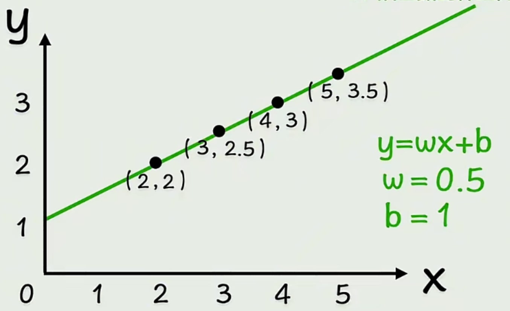

- 否则就是不断调整w和b，找到一个大差不差的函数

    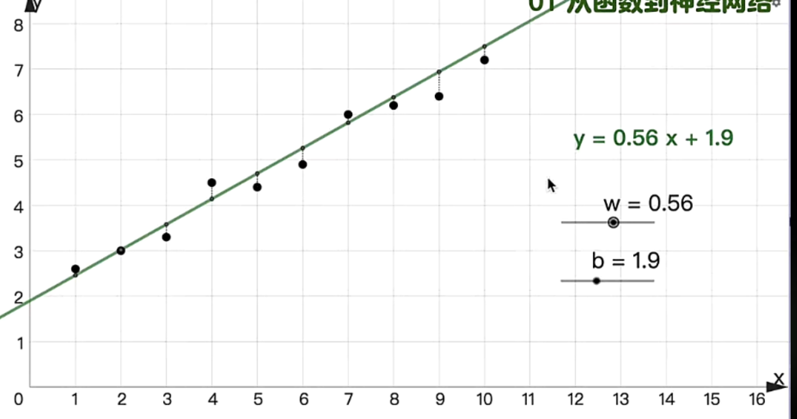

## 非线性函数 f(x) = g(wx + b) 也叫做激活函数
> 比如f(x) = (wx + b)^2, 比如f(x) = sin(wx + b)
- 但是通常函数不会只有这么点参数，也不会靠一层激活函数就能解决，现实中可能会有非常多的参数，并且套非常多层线性变换和激活函数

    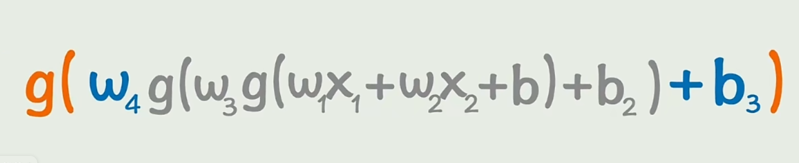

- 每多套一层激活函数，可以理解多了一层神经元，这就是一个简单的**神经网络**

- 可以看到神经网络是先从左边输入得到隐藏层，再从隐藏层得到输出层，就是神经网络的**前向传播**

    > 每层对应关系

    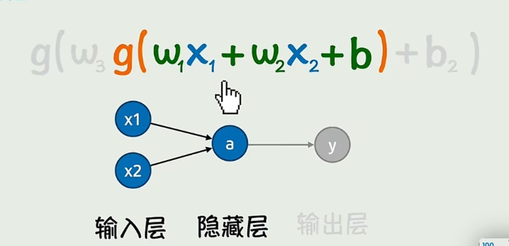

    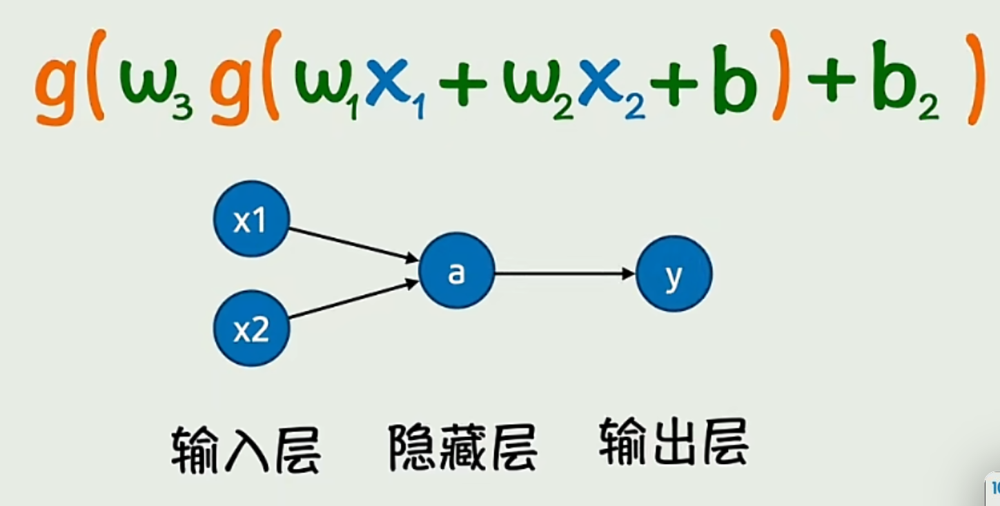

- 同时，隐藏层，输入层都可以无限增加，就会构建成一个非常庞大的神经网络，也会变成一个非常复杂的函数

    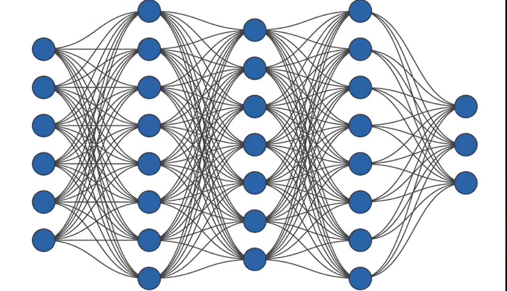

- 但不论变得多复杂，无非就是有一个**数据集**输入值x和输出值y，然后通过不断调整w和b的值得到一个最接近的函数

    

## 损失函数
- 是用来判断当前函数和真实数据的拟合度，AI训练就是通过不断调整w，b得到一个最小的损失函数

    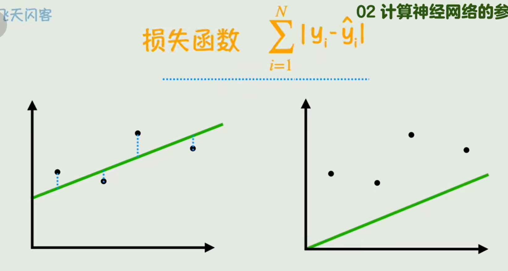

- **均方误差**是损失函数的一种，找平均的误差，那均方误差则是一个关于(w,b)的函数，因为是通过调整w,b得出的损失函数

    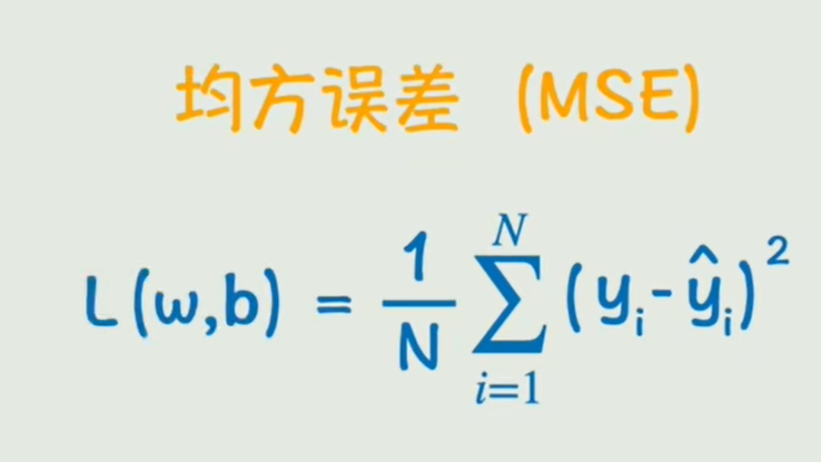

- 这里也引入了**偏导数**的概念和**线性回归**的概念
    - 对w求偏导：看w改一点点，损失函数变化多少。
    - 对b求偏导：看b改一点点，损失函数变化多少。
    - 这个过程就是线性回归，线性回归是机器学习里最基础的“监督学习”算法，找到最优的w，b让预测值尽可能接近真实值y。
    
    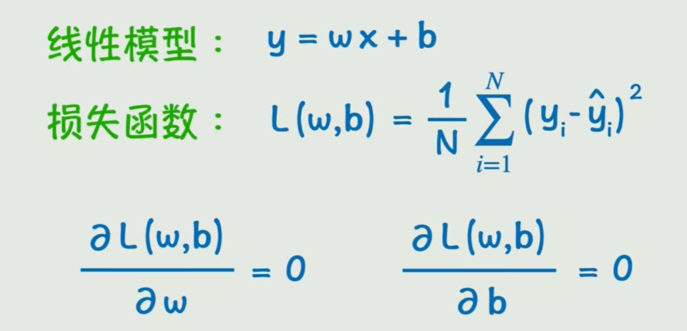

## 链式法则(微积分中的复合函数)，反向传播
- **如何求偏导数**：
    - 比如拿下面的例子解释，要得到w1对于L的偏导数：
        1. w1变化一个单位，看会使a变化多少
        2. 然后看a变化一个单位，会使y(预测值)变化多少
        3. 再看y(预测值)变化一个单位，会使L变化多少
        4. 最后把三者相乘，就知道w1变化一个单位会使得L变化多少，也就是得到w1的偏导数
- 这个过程通常是从右到左依次求导，其实也就是**反向传播**

        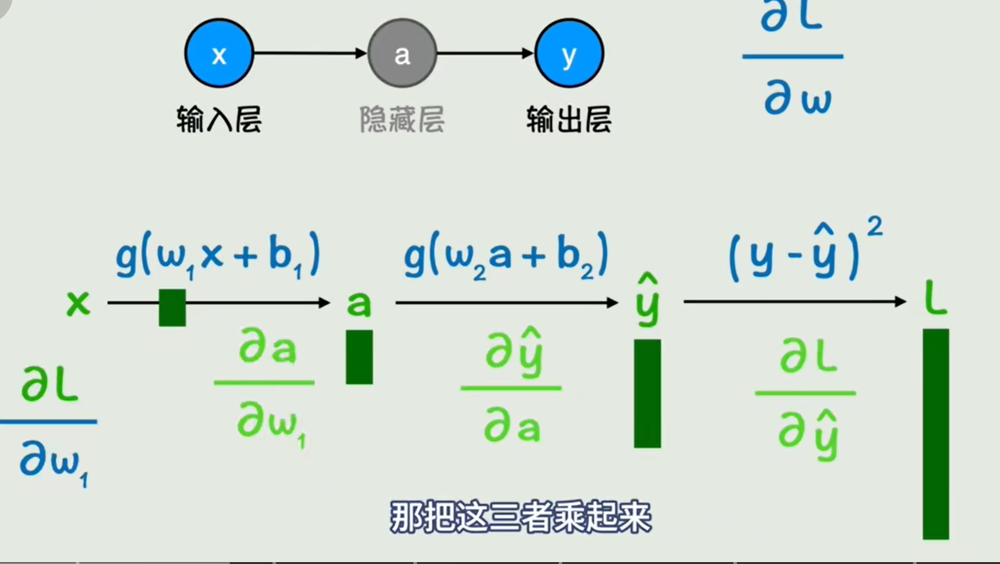

        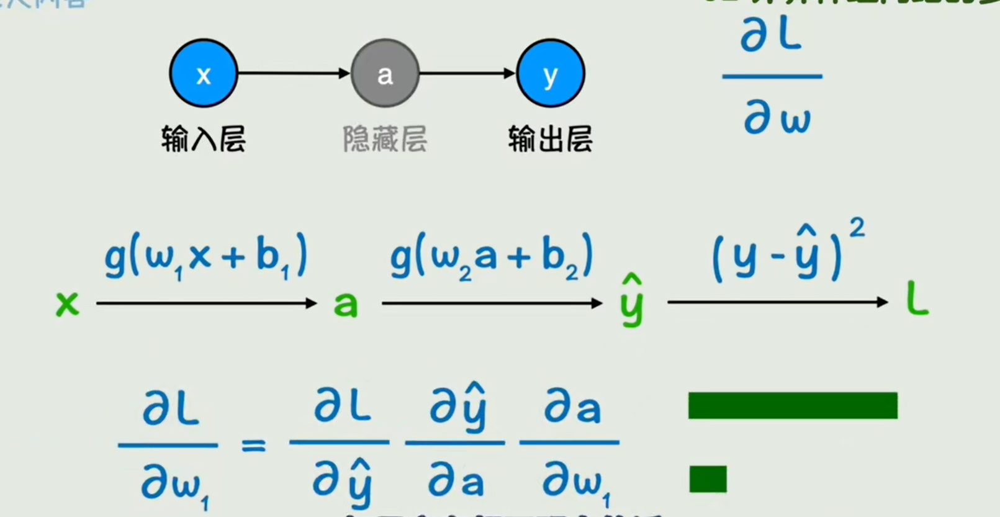

## 梯度下降
- **梯度下降**则是让w和b不断往偏导数的反方向去变化去减小损失函数

    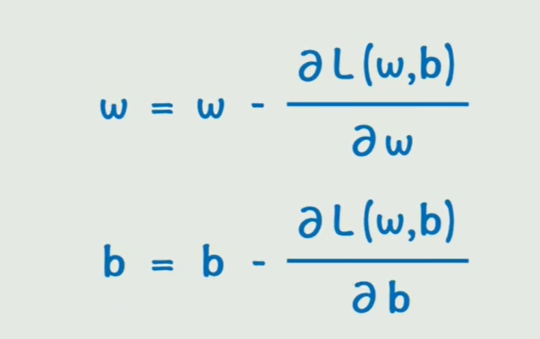

- 可以增加一个系数**学习率**去进一步增加变化的快慢

    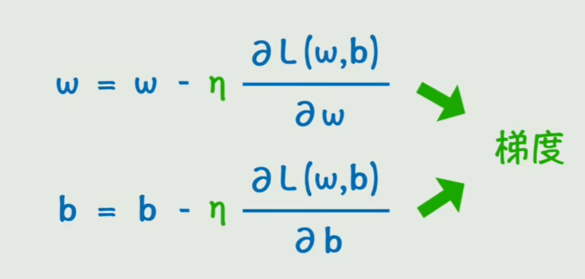

