### 模型架构
- 但是通常随着神经元的不断增多，每个神经元之间都有对应的函数，这样函数会越来越多并且复杂，通过矩阵的转化，可以增加GPU计算效率：

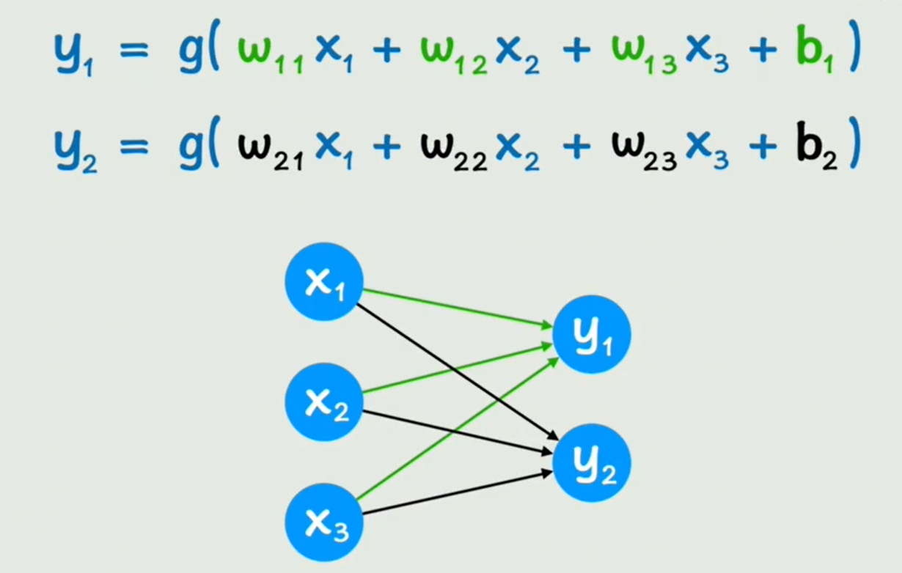

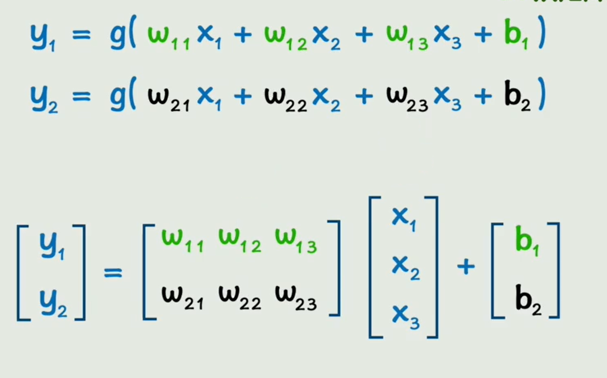

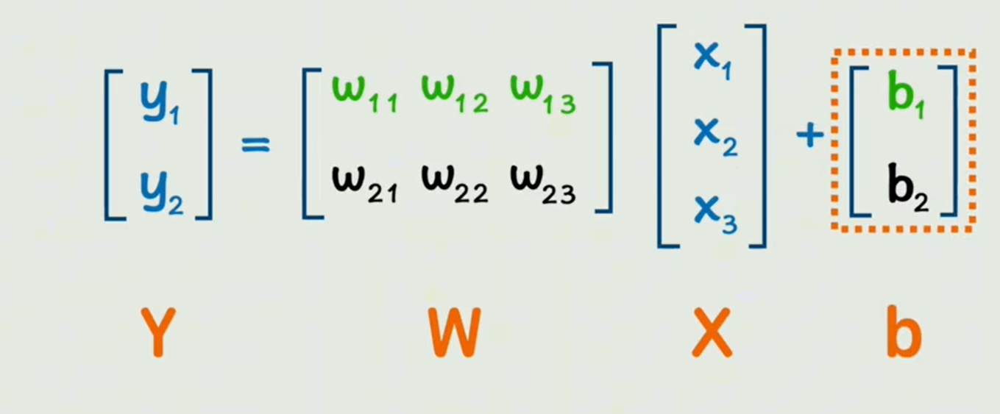

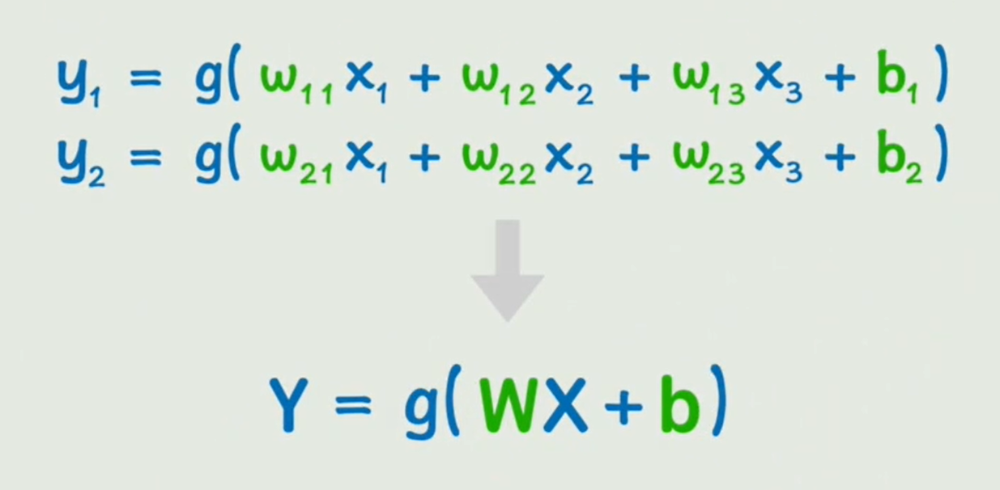

> 随着不同层增加，会通过以下方式代替
- 第一层：

    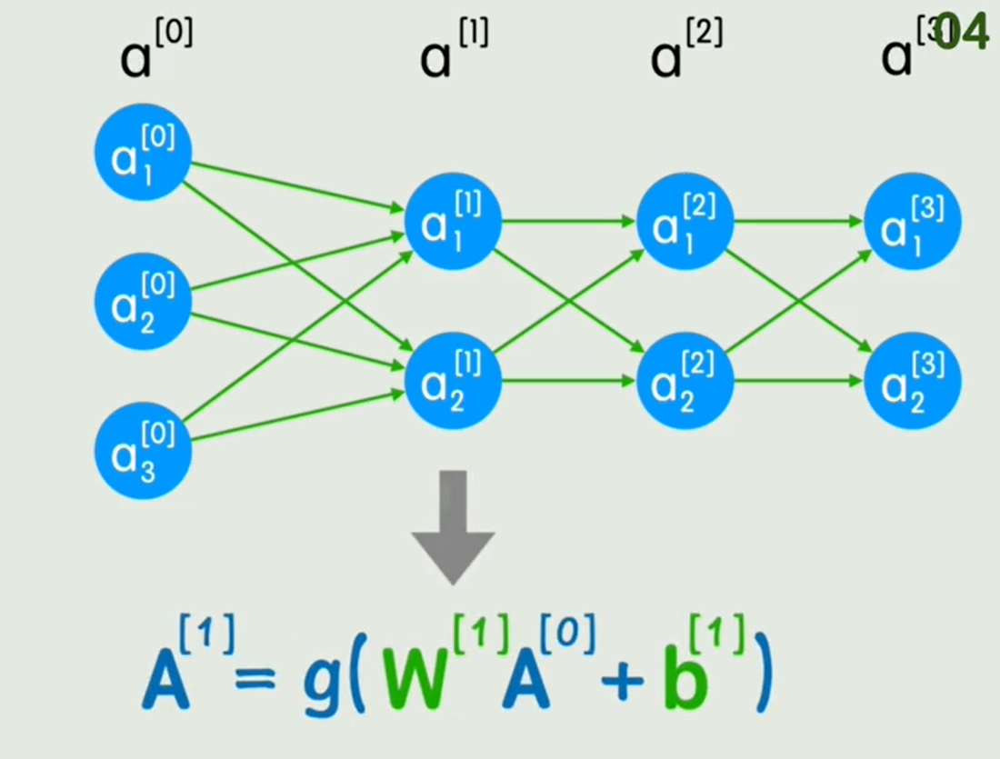

- 第二层：

    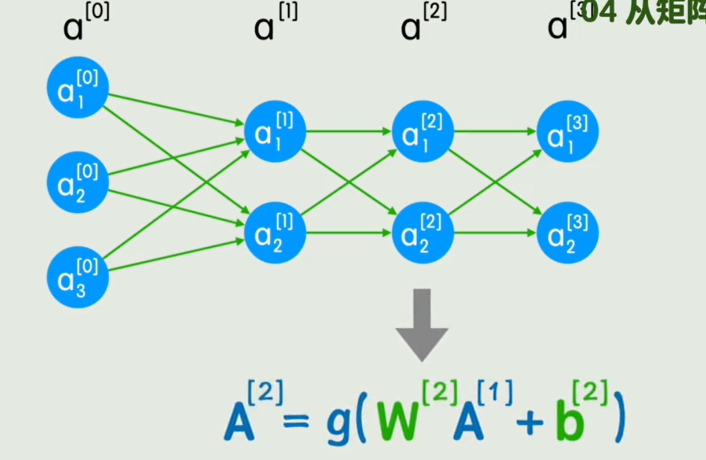

- 第三层：
    
    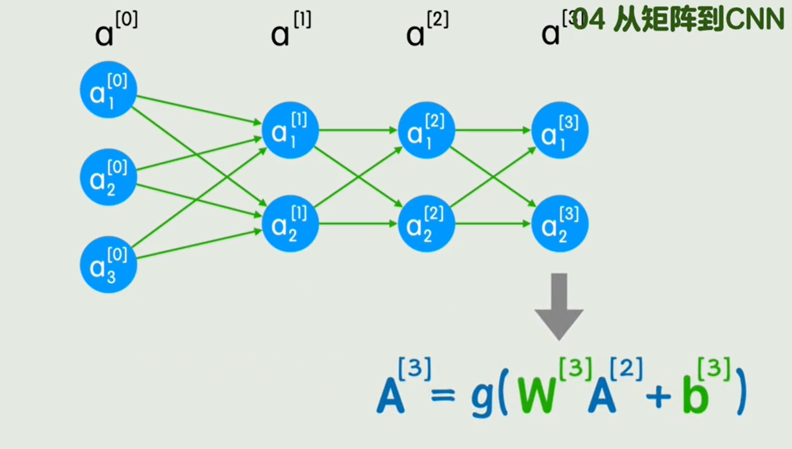

- 通用公式：

    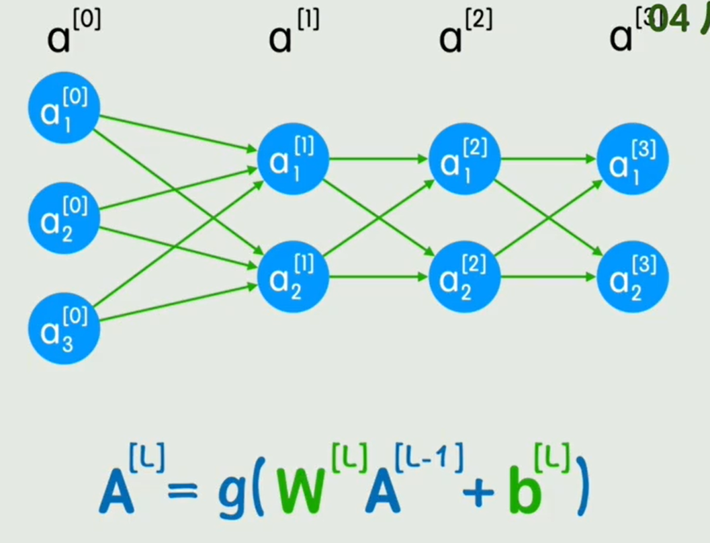

#### 卷积运算
- **全连接层**：每个神经元都与前面的所有神经元相连。
    
    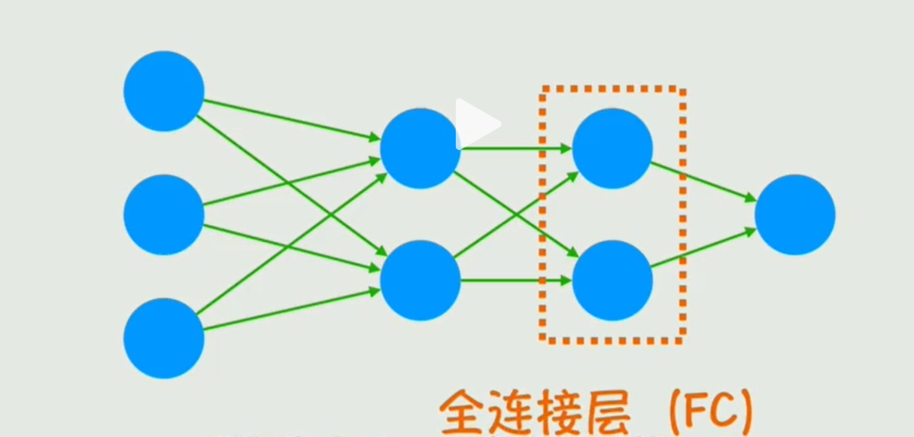

- 如果要识别一张30x30灰度图像，用全连接的坏处：
    - 参数量会非常庞大，因为喂给输入层就是900个神经元，加入下一层是1000个，那这个全连接的总参数就达到90W。
    - 丢失了局部空间信息（比如眼睛、鼻子、嘴巴的局部特征），每个像素是单独分析。

- **卷积层**：输入神经元和输出神经元 部分连接，由一个小的卷积核（filter）决定。
> 比如输入：一个 5×5 的图片 patch。卷积核：3×3。输出：只和 输入中一个 3×3 区域 相连，而不是所有像素。

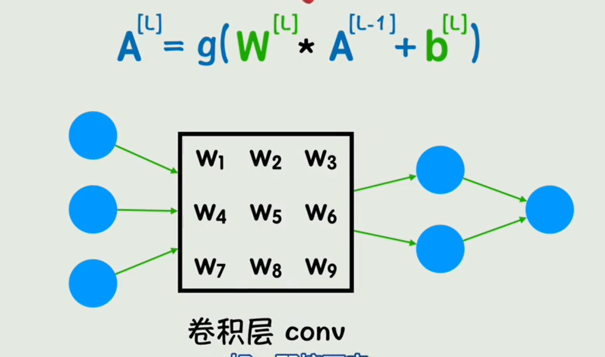

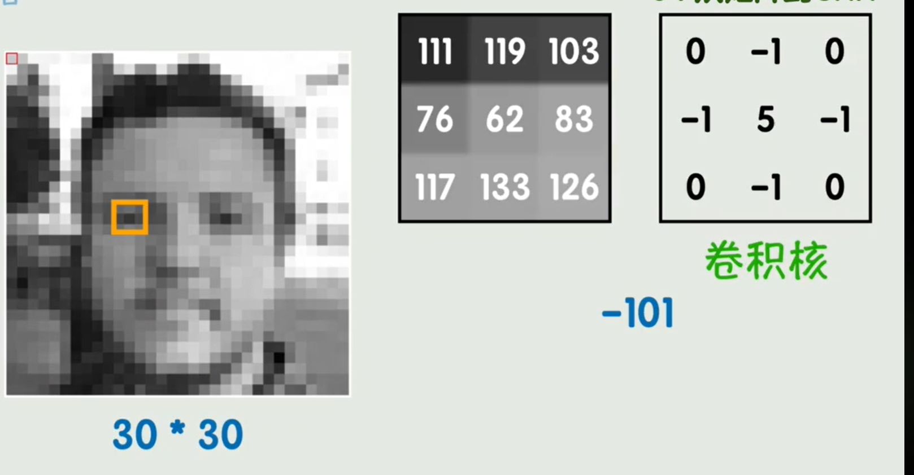

调整卷积核可以得到不同效果：

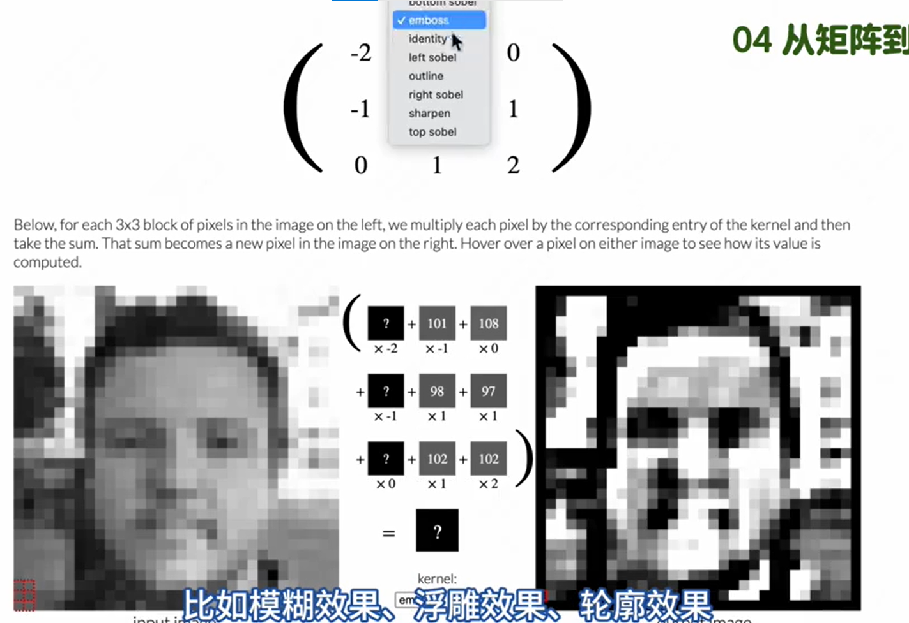

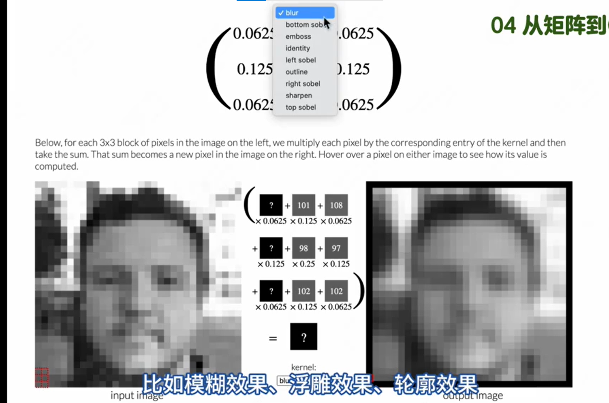

- 深度学习中，卷积核的值最初也是未知的，也是需要训练出来。